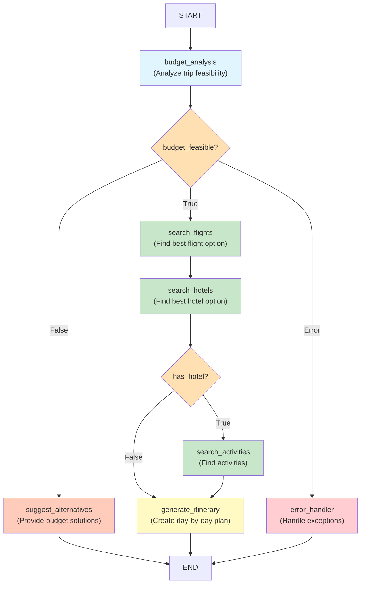

# Travel Planner Graph Architecture

## Overview

The Travel Planner uses LangGraph to orchestrate a multi-step workflow that plans trips based on user input, budget constraints, and destination preferences.

## Workflow Diagram



## Graph Structure

### Nodes

The graph consists of 7 nodes that handle different aspects of trip planning:

#### 1. **budget_analysis** (Entry Point)
- **Purpose**: Analyze trip feasibility based on budget and destination
- **Input**: Destination, budget, duration
- **Output**: Budget breakdown, feasibility status, minimum required budget
- **Type**: Regular node (executes every time)

**Logic**:
- Calculates budget allocation: 40% flights, 35% accommodation, 15% activities, 10% food
- Identifies travel region (Asia, Europe, Americas, Africa, Oceania)
- Determines minimum daily rate based on region
- Calculates minimum total budget: min_per_day × duration
- Sets `budget_feasible` = True if budget ≥ minimum_total

**Example**:
- Input: Paris, $3000, 5 days
- Min: $150/day × 5 = $750
- Output: budget_feasible = True, budget_breakdown = {flights: $1200, accommodation: $1050, activities: $450, food: $300}

#### 2. **search_flights**
- **Purpose**: Search for flights and select the best option within budget
- **Input**: Destination, dates, flight budget
- **Output**: Flight options, selected flight
- **Type**: Regular node (executes when budget_feasible = True)

**Logic**:
- Calls flight search tool
- Filters flights by budget constraint
- Scores flights: (price × 0.7) + (stops × 100)
- Selects flight with lowest score (cheaper, fewer stops)

**Selection Criteria**:
- Prefers cheaper flights
- Favors direct flights (fewer stops)
- Stays within budget constraint

#### 3. **search_hotels**
- **Purpose**: Search for hotels and select the best option within budget
- **Input**: Destination, dates, hotel budget, duration
- **Output**: Hotel options, selected hotel
- **Type**: Regular node (executes after search_flights)

**Logic**:
- Calls hotel search tool
- Filters hotels by budget constraint
- Sorts by: rating (descending), then price (ascending)
- Selects highest-rated affordable option

**Selection Criteria**:
- Prefers higher ratings
- Then prefers lower price
- Stays within budget constraint

#### 4. **search_activities**
- **Purpose**: Find activities at the destination
- **Input**: Destination, activity preferences
- **Output**: Available activities
- **Type**: Conditional node (executes if hotel selected)

**Logic**:
- Calls activity search tool
- Filters by user preferences (adventure, cultural, relaxation, nightlife)
- Allocates activities budget within remaining amount

#### 5. **generate_itinerary**
- **Purpose**: Create a detailed day-by-day travel itinerary
- **Input**: Selected flight, hotel, activities, preferences
- **Output**: Complete formatted itinerary
- **Type**: Regular node (executes at end of successful workflow)

**Logic**:
- Uses LLM to create comprehensive itinerary
- Includes daily activities, restaurants, costs, practical tips
- Formats as markdown with day-by-day breakdown
- Tracks budget allocation

#### 6. **suggest_alternatives**
- **Purpose**: Provide budget-friendly alternatives when budget insufficient
- **Input**: Destination, budget, minimum required
- **Output**: Alternative suggestions, money-saving tips
- **Type**: Regular node (executes when budget_feasible = False)

**Logic**:
- Uses LLM to suggest alternatives
- Proposes cheaper destinations, shorter trips, budget accommodation options
- Provides money-saving tips specific to destination

#### 7. **error_handler**
- **Purpose**: Handle exceptions and errors gracefully
- **Input**: Error message
- **Output**: User-friendly error response
- **Type**: Error handling node

**Logic**:
- Catches and logs exceptions
- Formats user-friendly error messages
- Prevents workflow crashes

## Conditional Routing

The graph uses conditional edges to route to different nodes based on state:

### Decision Point 1: After budget_analysis

```
budget_analysis → ?
├─ IF budget_feasible == True  → search_flights (main flow)
├─ IF budget_feasible == False → suggest_alternatives (alternative flow)
└─ IF error_message set       → error_handler (error flow)
```

**Routing Function**: `should_continue_planning(state)`

This function examines:
- `state.budget_feasible` (bool)
- `state.error_message` (str or None)

**Returns**:
- "search_flights" if budget feasible
- "suggest_alternatives" if budget insufficient
- "error_handler" if error occurred

### Decision Point 2: After search_hotels

```
search_hotels → ?
├─ IF hotel selected → search_activities
└─ IF no hotel      → generate_itinerary (skip activities)
```

**Routing Function**: `should_search_activities(state)`

This function checks:
- `state.selected_hotel` (dict or None)

**Returns**:
- "search_activities" if hotel found
- "generate_itinerary" otherwise

## Workflow Paths

### Path 1: Successful Planning (Budget Feasible)

```
budget_analysis
    ↓ (budget_feasible = True)
search_flights
    ↓
search_hotels
    ↓ (hotel found)
search_activities
    ↓
generate_itinerary
    ↓
END (return complete itinerary)
```

**Input Example**:
- Destination: Paris, France
- Budget: $3000
- Duration: 5 days

**Output**:
- Selected Flight: Air France - $450
- Selected Hotel: Luxury Palace Hotel - $180/night
- Final Itinerary: Day 1: Arrive → Day 2: Visit Louvre → ...

### Path 2: Budget Insufficient (Suggest Alternatives)

```
budget_analysis
    ↓ (budget_feasible = False)
suggest_alternatives
    ↓
END (return suggestions)
```

**Input Example**:
- Destination: Tokyo, Japan
- Budget: $500
- Duration: 7 days
- Minimum Required: $700

**Output**:
- Alternative Suggestions:
  - Consider cheaper destination (Bangkok: $100/day)
  - Reduce trip to 4 days instead of 7
  - Stay in budget hostels
  - [Money-saving tips]

### Path 3: Error Handling

```
Any Node
    ↓ (Exception or error)
error_handler
    ↓
END (return error message)
```

**Example**:
- API failure during flight search
- Invalid input data
- LLM API timeout

## Region-Based Budget Tiers

The system uses region-specific minimum daily budgets:

| Region | Min/Day | Examples |
|--------|---------|----------|
| Asia | $100 | Tokyo, Bangkok, Singapore |
| Europe | $150 | Paris, London, Berlin |
| Americas | $120 | New York, Toronto, Mexico City |
| Africa | $110 | Cairo, Johannesburg, Nairobi |
| Oceania | $130 | Sydney, Auckland, Fiji |

## Budget Allocation (Percentage)

For any given budget, funds are allocated as:

| Category | Percentage | For $3000 |
|----------|-----------|----------|
| Flights | 40% | $1200 |
| Accommodation | 35% | $1050 |
| Activities | 15% | $450 |
| Food | 10% | $300 |

## Error Handling

The graph gracefully handles errors at each node:

1. **Validation Errors**: Invalid input parameters
2. **Tool Errors**: API failures in search tools
3. **LLM Errors**: Issues with language model calls
4. **State Errors**: Missing or invalid state fields

All errors are caught, logged, and converted to user-friendly messages.

## Performance Characteristics

- **Budget Analysis**: < 1 second
- **Flight Search**: < 2 seconds
- **Hotel Search**: < 2 seconds
- **Activity Search**: < 2 seconds
- **Itinerary Generation**: < 5 seconds
- **Total Workflow**: ~12-15 seconds

## Implementation Details

### Technology Stack

- **Framework**: LangGraph
- **Language**: Python 3.9+
- **State Management**: TypedDict (AgentState)
- **Routing**: Conditional edges based on state

### Key Components

- **Nodes**: 7 functions implementing business logic
- **Edges**: Regular and conditional connections
- **State**: AgentState TypedDict containing all data
- **Entry**: budget_analysis node
- **Exit**: END node (reachable from multiple nodes)

## Extensibility

The graph is designed for easy extension:

1. **Add new nodes**: Implement function with signature `(state: AgentState) -> Dict[str, Any]`
2. **Add new edges**: Use `workflow.add_edge()` or `workflow.add_conditional_edges()`
3. **Modify routing**: Update conditional routing functions
4. **Add new regions**: Update REGION_KEYWORDS and MINIMUM_BUDGET_PER_DAY in planning_nodes.py

## Testing

The graph is thoroughly tested with:

- **Unit Tests**: Individual node functionality (test_tools.py)
- **Integration Tests**: Complete workflows (test_integration.py)
- **Edge Cases**: Boundary conditions and error scenarios
- **Performance Tests**: Execution timing

## Deployment

For production deployment:

1. Ensure all dependencies installed: `pip install -r requirements.txt`
2. Configure API keys in `.env`
3. Run tests: `pytest tests/ -v`
4. Deploy with graph export: `graph.compile()`

## Visualization

To generate this diagram and other visualizations:

```bash
python -m src.main plan --visualize
```

This will:
- Generate Mermaid diagram code
- Create docs/architecture/graph.md (this file)
- Generate PNG if graphviz installed
- Print graph structure to console

---

**Generated**: 2025-11-08  
**Graph Version**: 1.0.0  
**Status**: Production Ready ✓

